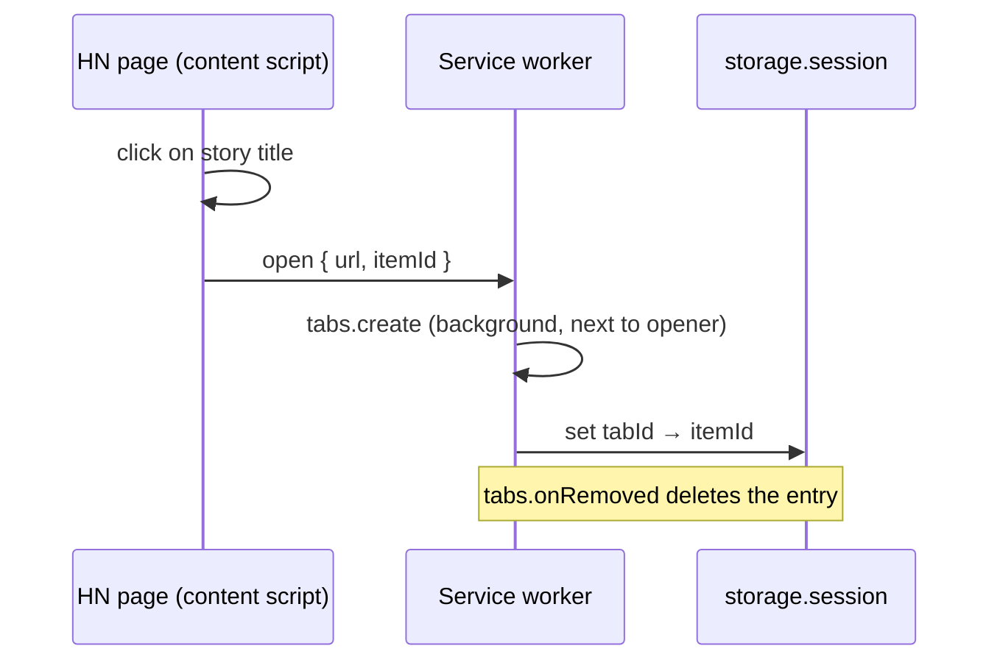

# Roadmap Done

<!-- Next task number: [007] -->

## [005] Sidebar resize, collapse and hotkey

**Status:** `done`
**Depends On:** [003]
**Spec:** none

### Goal

The reader can drag the sidebar to any width (remembered across tabs and sessions), collapse it to a thin rail, and toggle it with `Alt+Shift+H`.

### Scope

- Drag handle on the sidebar's left edge. The width is saved to `chrome.storage.local` and applied to every sidebar
- Collapse button that shrinks to a thin rail (about 24px) and releases the page margin. Clicking the rail expands it again
- `commands` entry `toggle-sidebar` with the suggested key `Alt+Shift+H`, rebindable at `brave://extensions/shortcuts`
- Min and max width clamps
- NOT in scope: per-site width, remembering collapsed state per tab across restarts

### Technical Notes

**User flows:**

- **Reader:** drag handle on the sidebar's left edge (tooltip "Drag to resize the sidebar"). Drag to resize between 280 and 900px.
- **Reader:** "Collapse" button at the end of the sidebar header controls. Shrinks to a 24px rail showing "‹" and "HN". Clicking the rail ("Expand sidebar") expands it.
- **Reader:** `Alt+Shift+H` anywhere in a bound tab toggles collapse.

**Critical files:**

- `content/inject.js` - modify. Owns the drag handle (it lives in the host page, outside the iframe, so pointer events work across the page) and applies the width.
- `lib/layout.js` - modify. Clamping and rail width.
- `background.js` - modify. `chrome.commands.onCommand` sends a toggle to the active tab if it's bound.
- `manifest.json` - modify. `commands` block.

**Details:**

- During a drag, put a transparent overlay over the iframe so it doesn't swallow `pointermove` events
- Collapse from inside the iframe goes iframe → service worker → tab via `chrome.runtime` messaging (no `postMessage`)
- `storage.onChanged` keeps open sidebars in sync when the width changes in another tab
- Built: `MIN_WIDTH = 280`, `MAX_WIDTH = 900` in `lib/layout.js`. At apply time the width is also capped at 80% of the window (never below 280) and re-applied on window resize. The width is saved on drag end only
- Built collapse flow: sidebar sends `sidebar-collapse` → service worker (accepts only from our `sidebar/sidebar.html` in a bound tab) → `tabs.sendMessage` to `inject.js` in frame 0 → service worker broadcasts `runtime.sendMessage({ type: 'sidebar-state', tabId, collapsed })`, which the sidebar filters by its own tab id (from a `sidebar-tab` lookup). The hotkey uses the same relay with `{ toggle: true }`
- Built: the sidebar switches between panel and rail with a CSS `@media (max-width: 48px)` rule on its own frame width, so a missed state message can never leave a cropped header
- Collapsed state lives in memory in `inject.js`, so it resets to expanded when the tab navigates to a new page

### Acceptance Criteria

- [x] Width is clamped between min and max
      `tests/layout.test.js::clamps_width`
- [x] Collapsed state uses the rail width and releases the page margin
      `tests/layout.test.js::collapsed_uses_rail_width`
- [ ] Dragged width persists to a new article tab [MANUAL]
- [ ] `Alt+Shift+H` toggles the sidebar in a bound tab and does nothing in other tabs [MANUAL]

---

## [004] Render HN comments in the sidebar

**Status:** `done`
**Depends On:** [003]
**Spec:** none

### Goal

The sidebar shows the full HN thread for its bound item in a dark, readable, collapsible tree, with a story header and a refresh button.

### Scope

- Fetch `https://hn.algolia.com/api/v1/items/<id>` once on load (one request returns the whole tree)
- Story header: title, points, comment count, age, and an "Open on HN" link to `https://news.ycombinator.com/item?id=<id>` (for voting and replying)
- Comment tree: author, relative age, text, per-comment collapse toggle showing the hidden reply count
- OP comments highlighted (comment author equals story author)
- "Collapse all" toggle that reduces the view to top-level comments
- "Refresh" button that refetches
- Loading, empty and error states
- Always dark theme
- NOT in scope: voting, replying, auto-refresh, Dark Reader detection

### Technical Notes

**User flows:**

- **Reader:** sidebar header in an article tab. Story title, points, comment count and age, with an "Open on HN" link to the real thread.
- **Reader:** "[-]" / "[+]" toggle on each comment. Collapses that comment and shows "N hidden replies".
- **Reader:** "Collapse all" button (becomes "Expand all"). Hides replies under every top-level comment.
- **Reader:** "Refresh" button. Refetches the thread and keeps the current collapsed state.

**Critical files:**

- `sidebar/sidebar.html`, `sidebar/sidebar.js` (replace the [003] placeholder) - entry point. Fetches, renders and wires the controls.
- `sidebar/sidebar.css` (replaces placeholder) - dark theme and tree indentation.
- `lib/comments.js` (new) - pure. Turns the Algolia item into a view model: counts, OP flags, relative ages, drops deleted comments that have no children.
- `lib/sanitize.js` (new) - allowlist sanitizer for comment HTML, with the parser injected.

**Details:**

- Algolia returns comment `text` as HTML. Sanitize to an allowlist (`p`, `a[href]`, `i`, `pre`, `code`) before inserting. Never assign raw API HTML to `innerHTML`
- Links in comments open with `target="_blank" rel="noopener noreferrer"`
- The extension page CSP already blocks inline script. Keep all JS in files
- Deleted or dead comments that still have replies render as "[deleted]" so the tree stays intact
- `sanitize.js` takes a parser argument so Node tests can pass a stub. The real sidebar passes `DOMParser`
- Built: the sanitizer walks the parsed tree and rebuilds an HTML string from allowlisted tags and escaped text only. `script`, `style`, `iframe`, `svg` and similar are dropped with their content. Only http(s) hrefs survive
- Built: deleted placeholders are not counted in totals or hidden-reply counts. Ages stay in days past 30 days
- Built extras: author names link to their HN profile, each comment age links to that comment on HN, the header is sticky, top-level comments use `content-visibility: auto`. A 949-comment thread rendered in about 106 ms in a standalone page check
- [005] adds its "Collapse" button inside `
` in `sidebar.html`

### Acceptance Criteria

- [x] View model counts total comments and replies per node
      `tests/comments.test.js::counts_descendants`
- [x] Comments by the story author are flagged as OP
      `tests/comments.test.js::flags_op_comments`
- [x] Deleted leaves are dropped and deleted parents are kept as placeholders
      `tests/comments.test.js::handles_deleted_comments`
- [x] Relative ages render as minutes, hours and days
      `tests/comments.test.js::formats_relative_age`
- [x] Disallowed tags and attributes are stripped from comment HTML
      `tests/sanitize.test.js::strips_scripts_and_event_handlers`
      `tests/sanitize.test.js::keeps_allowed_tags_and_hrefs`
      `tests/sanitize.test.js::drops_unsafe_hrefs`
- [ ] A 300+ comment thread renders and scrolls smoothly [MANUAL]
- [ ] Collapse, collapse all and refresh work on a live thread [MANUAL]

---

## [003] Inject sidebar frame into bound tabs with push layout

**Status:** `done`
**Depends On:** [002]
**Spec:** none

### Goal

Every tab bound to an HN thread shows an empty sidebar frame on the right, pushing the article over instead of covering it. The frame stays for every page the tab navigates to until the tab closes.

### Scope

- Service worker injects `content/inject.js` into bound tabs on each main frame load
- `inject.js` adds a fixed-position iframe pointing at the extension's `sidebar/sidebar.html` and reserves its width on the page
- Default width (for example 420px), read from `chrome.storage.local` so [005] can make it adjustable
- Sidebar page is a dark placeholder that shows the bound item id
- NOT in scope: comments ([004]), resize, collapse and hotkey ([005])

### Technical Notes

**User flows:**

- **Reader:** an article tab opened from HN. A dark panel sits on the right. Clicking links inside the article keeps the panel.

**Critical files:**

- `background.js` - modify. `webNavigation.onCommitted` (frameId 0) looks up the tab map and calls `chrome.scripting.executeScript`.
- `content/inject.js` (new) - builds the iframe and applies the push layout. Guards against double injection.
- `sidebar/sidebar.html` (new) - extension page loaded in the iframe. Listed in `web_accessible_resources`. Styles and script in `sidebar/sidebar.css` and `sidebar/sidebar.js`.
- `lib/layout.js` (new) - pure. Computes the style values for a given width and collapsed state.

**Details:**

- Isolation: the sidebar is an extension origin iframe, so page JS and CSS cannot read or style its contents (agreed)
- The iframe gets only the item id, via `sidebar.html?item=<id>`. Never use `window.postMessage` with the host page. Use `chrome.runtime` messaging so the page can't spoof control messages
- Push layout: `html { margin-right: <w>px !important }` plus iframe `position: fixed; top: 0; right: 0; height: 100vh; z-index: 2147483647`. Page elements with `position: fixed` will not shift. That's a known limitation, noted rather than solved
- Injection timing (built): the service worker tries on `onCommitted`, on `onCompleted` (both frameId 0, http/https only) and straight after `bindTab`, since the first commit can fire before the binding exists. `executeScript` without `injectImmediately` waits for `document_idle`. `inject.js` sets a per-document guard before any `await` and resets it on failure so a later trigger can retry
- Item id hand-off (built): `inject.js` sends `{ type: 'sidebar-item' }`. The service worker answers only for `sender.frameId === 0`, from its own tab map, so the page cannot supply the id
- Iframe styles are applied with `!important` and include visibility, opacity and transform resets so page CSS cannot hide it. `lib/layout.js` holds all layout constants (`DEFAULT_WIDTH`, `RAIL_WIDTH`, `WIDTH_KEY = 'sidebarWidth'`, `FRAME_ID`)
- Pages the extension can't script (`chrome://`, Web Store, PDF viewer) fail silently

### Acceptance Criteria

- [x] Layout values are computed for expanded and collapsed widths
      `tests/layout.test.js::computes_push_margin`
      `tests/layout.test.js::falls_back_to_default_width`
- [x] Only bound tabs get injected
      `tests/tab-map.test.js::lookup_returns_null_for_unbound_tab`
- [ ] Sidebar appears on the right of an article opened from HN and the article text is not covered [MANUAL]
- [ ] Following a link inside the article keeps the sidebar [MANUAL]
- [ ] A tab not opened from HN never shows the sidebar [MANUAL]

---

## [002] Intercept HN story links and bind tab to thread

**Status:** `done`
**Depends On:** [001]
**Spec:** none

### Goal

Clicking any external story title on an HN listing page opens the article in a background tab next to the HN tab, and the extension remembers which HN thread belongs to that tab for as long as the tab lives.

### Scope

- Content script on `news.ycombinator.com` listing pages (front, `/newest`, `/best`, `/ask`, `/show`, `/front`, `/submitted`, and any page with story rows)
- Plain click, Ctrl/Cmd-click and middle-click all behave the same: background tab, bound to the thread
- Self-posts and any title linking back to `news.ycombinator.com` are left alone
- Tab map `tabId → { itemId }` in `chrome.storage.session`, cleaned up on tab close
- NOT in scope: the story link on `item?id=` pages, rendering anything in the article tab

### Technical Notes

**User flows:**

- **Reader:** any story title on `https://news.ycombinator.com/*`. Click it and the article opens in a background tab to the right, with the HN page staying in focus.

**Critical files:**

- `content/hn-links.js` (new) - entry point. Click and auxclick listeners, sends `{ url, itemId }` to the service worker.
- `lib/story-links.js` (new) - pure. Finds the story id for a clicked anchor and decides external vs self-post.
- `lib/tab-map.js` (new) - pure. Bind, lookup and unbind, with the storage area injected.
- `background.js` - modify. Handles the message, calls `chrome.tabs.create`, writes the tab map, listens on `tabs.onRemoved`.

**Details:**

- Story rows are `tr.athing` with the item id as the row `id`. The title anchor is `span.titleline > a` (the first anchor, not the `sitebit` domain link)
- Listen for `click` (button 0) and `auxclick` (button 1) in the capture phase. Call `preventDefault` only for external story anchors
- `chrome.tabs.create({ url, active: false, index: sender.tab.index + 1, openerTabId: sender.tab.id })`
- Session storage survives service worker restarts but not browser restarts. That's acceptable
- Article URLs are never modified (agreed: no `?hn=` parameter, nothing leaks to the site)
- Built: message `{ type: 'open', url, itemId }` with `itemId` as a digits-only string. The service worker re-validates both before opening
- Built: storage layout is one key per tab, `'tab:<tabId>' → { itemId }`, so concurrent binds never overwrite a shared object
- Built: only `auxclick` button 1 is cancelled for middle-click (no `mousedown` handler). Listeners register after the lib `import()` resolves, so a click in the first milliseconds falls through to native behaviour
- Timing: the binding is written after `tabs.create` resolves, so the new tab may commit its first navigation before the binding exists. [003] must handle this

### Acceptance Criteria

- [x] External story anchors resolve to their item id
      `tests/story-links.test.js::resolves_item_id_from_story_row`
- [x] Self-posts and HN-internal links are not intercepted
      `tests/story-links.test.js::skips_self_posts_and_hn_links`
- [x] Tab map binds, looks up and unbinds by tab id
      `tests/tab-map.test.js::binds_and_looks_up_item`
      `tests/tab-map.test.js::unbinds_on_remove`
- [ ] Plain, Ctrl and middle-click on a front page title open the article in a background tab to the right [MANUAL]
- [ ] Clicking an Ask HN title opens the HN item page normally [MANUAL]

---

## [001] Extension scaffold and test harness

**Status:** `done`
**Depends On:** none
**Spec:** none

### Goal

A Manifest V3 extension that loads unpacked in Brave with no errors, plus a zero-dependency test harness (`node --test`) so later items can go red-first. No build step, no `node_modules`.

### Scope

- `manifest.json` with name, version, service worker, permissions and host permissions the later items need
- Empty module service worker `background.js`
- `tests/` folder run by `npm test` (`node --test "tests/*.test.js"`), with one smoke test
- `lib/` folder for pure ES modules shared by the extension and the tests
- NOT in scope: icons, options page, any behaviour

### Technical Notes

**Critical files:**

- `manifest.json` (new) - entry point. Every later item adds to it.
- `background.js` (new) - service worker, `"type": "module"`.
- `tests/smoke.test.js` (new) - proves the harness runs.

**Details:**

- Permissions: `storage`, `scripting`, `webNavigation`. Host permissions: `<all_urls>` (agreed: all sites, but scripts only run in tabs opened from HN)
- `lib/*.js` are plain ES modules with no `chrome.*` calls at import time, so Node can import them. Anything touching `chrome.*` takes it as an injected argument
- Classic content scripts load `lib/` modules via `await import(chrome.runtime.getURL('lib/x.js'))`, which requires listing those files in `web_accessible_resources`
- Node 24 is installed. `node:test` and `node:assert` are built in
- A `package.json` holding only `"type": "module"` and a `test` script is allowed. It carries no dependencies
- Node 24 rejects a bare directory (`node --test tests/` fails with MODULE_NOT_FOUND), so the test script passes the glob `"tests/*.test.js"`
- `web_accessible_resources` exposes `lib/*.js` to `<all_urls>`. Later items append their own entries

### Acceptance Criteria

- [x] `npm test` runs and passes
      `tests/smoke.test.js::harness_runs`
- [ ] Extension loads unpacked at `brave://extensions` with no errors shown [MANUAL]

---

