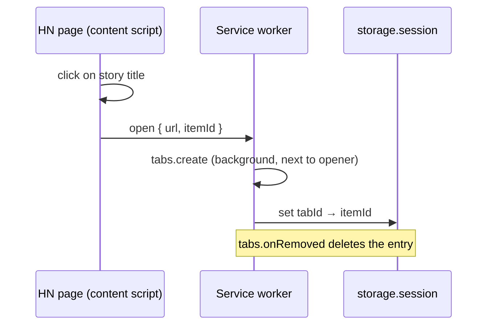

# Roadmap Done

<!-- Next task number: [007] -->

## [002] Intercept HN story links and bind tab to thread

**Status:** `done`
**Depends On:** [001]
**Spec:** none

### Goal

Clicking any external story title on an HN listing page opens the article in a background tab next to the HN tab, and the extension remembers which HN thread belongs to that tab for as long as the tab lives.

### Scope

- Content script on `news.ycombinator.com` listing pages (front, `/newest`, `/best`, `/ask`, `/show`, `/front`, `/submitted`, and any page with story rows)
- Plain click, Ctrl/Cmd-click and middle-click all behave the same: background tab, bound to the thread
- Self-posts and any title linking back to `news.ycombinator.com` are left alone
- Tab map `tabId → { itemId }` in `chrome.storage.session`, cleaned up on tab close
- NOT in scope: the story link on `item?id=` pages, rendering anything in the article tab

### Technical Notes

**User flows:**

- **Reader:** any story title on `https://news.ycombinator.com/*`. Click it and the article opens in a background tab to the right, with the HN page staying in focus.

**Critical files:**

- `content/hn-links.js` (new) - entry point. Click and auxclick listeners, sends `{ url, itemId }` to the service worker.
- `lib/story-links.js` (new) - pure. Finds the story id for a clicked anchor and decides external vs self-post.
- `lib/tab-map.js` (new) - pure. Bind, lookup and unbind, with the storage area injected.
- `background.js` - modify. Handles the message, calls `chrome.tabs.create`, writes the tab map, listens on `tabs.onRemoved`.

**Details:**

- Story rows are `tr.athing` with the item id as the row `id`. The title anchor is `span.titleline > a` (the first anchor, not the `sitebit` domain link)
- Listen for `click` (button 0) and `auxclick` (button 1) in the capture phase. Call `preventDefault` only for external story anchors
- `chrome.tabs.create({ url, active: false, index: sender.tab.index + 1, openerTabId: sender.tab.id })`
- Session storage survives service worker restarts but not browser restarts. That's acceptable
- Article URLs are never modified (agreed: no `?hn=` parameter, nothing leaks to the site)
- Built: message `{ type: 'open', url, itemId }` with `itemId` as a digits-only string. The service worker re-validates both before opening
- Built: storage layout is one key per tab, `'tab:<tabId>' → { itemId }`, so concurrent binds never overwrite a shared object
- Built: only `auxclick` button 1 is cancelled for middle-click (no `mousedown` handler). Listeners register after the lib `import()` resolves, so a click in the first milliseconds falls through to native behaviour
- Timing: the binding is written after `tabs.create` resolves, so the new tab may commit its first navigation before the binding exists. [003] must handle this

### Acceptance Criteria

- [x] External story anchors resolve to their item id
      `tests/story-links.test.js::resolves_item_id_from_story_row`
- [x] Self-posts and HN-internal links are not intercepted
      `tests/story-links.test.js::skips_self_posts_and_hn_links`
- [x] Tab map binds, looks up and unbinds by tab id
      `tests/tab-map.test.js::binds_and_looks_up_item`
      `tests/tab-map.test.js::unbinds_on_remove`
- [ ] Plain, Ctrl and middle-click on a front page title open the article in a background tab to the right [MANUAL]
- [ ] Clicking an Ask HN title opens the HN item page normally [MANUAL]

---

## [001] Extension scaffold and test harness

**Status:** `done`
**Depends On:** none
**Spec:** none

### Goal

A Manifest V3 extension that loads unpacked in Brave with no errors, plus a zero-dependency test harness (`node --test`) so later items can go red-first. No build step, no `node_modules`.

### Scope

- `manifest.json` with name, version, service worker, permissions and host permissions the later items need
- Empty module service worker `background.js`
- `tests/` folder run by `npm test` (`node --test "tests/*.test.js"`), with one smoke test
- `lib/` folder for pure ES modules shared by the extension and the tests
- NOT in scope: icons, options page, any behaviour

### Technical Notes

**Critical files:**

- `manifest.json` (new) - entry point. Every later item adds to it.
- `background.js` (new) - service worker, `"type": "module"`.
- `tests/smoke.test.js` (new) - proves the harness runs.

**Details:**

- Permissions: `storage`, `scripting`, `webNavigation`. Host permissions: `<all_urls>` (agreed: all sites, but scripts only run in tabs opened from HN)
- `lib/*.js` are plain ES modules with no `chrome.*` calls at import time, so Node can import them. Anything touching `chrome.*` takes it as an injected argument
- Classic content scripts load `lib/` modules via `await import(chrome.runtime.getURL('lib/x.js'))`, which requires listing those files in `web_accessible_resources`
- Node 24 is installed. `node:test` and `node:assert` are built in
- A `package.json` holding only `"type": "module"` and a `test` script is allowed. It carries no dependencies
- Node 24 rejects a bare directory (`node --test tests/` fails with MODULE_NOT_FOUND), so the test script passes the glob `"tests/*.test.js"`
- `web_accessible_resources` exposes `lib/*.js` to `<all_urls>`. Later items append their own entries

### Acceptance Criteria

- [x] `npm test` runs and passes
      `tests/smoke.test.js::harness_runs`
- [ ] Extension loads unpacked at `brave://extensions` with no errors shown [MANUAL]

---

